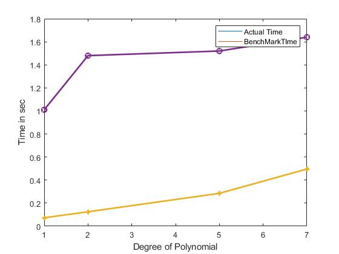
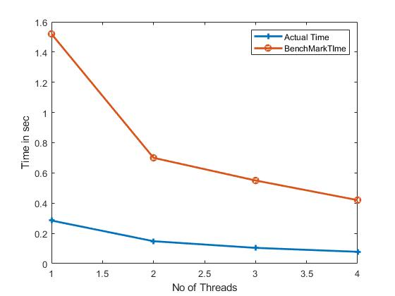

# Assigment 2 - HPC 039

* Earl Fernando Panimayam Fernando
* Anand Hariharan
* Anoop 

## Problem Description
Use posix threads to parallelize the given problem of finding the root of a given polynomial function . By using newton's method iteratively for calculating the root to which a certain point in space converges. By discritizing these points in the form of a matrix of given dimension with their extreme points having their real and imaginary part ranging from -2 and 2. Further use these values in creating a PPM image file for the time taken convergence of these roots and the root to which a certain point converges. 

## Arguments Parsing 

It was stated that the last argument would be the degree of the polynomial , so we asssumed that the last argument was the degree. The second and third arguments could be of any order but when we compare the strings 'l' and 't' , l is less that t ablhabetically so we made a comparision betweeen both the string and slipt the numbers after the letters and assigned them globally as the number of threads and dimensions.

~~~
if(argv[1][1]>argv[2][1])
		{threads=strtol((strtok(argv[1], "-t")),NULL,10); 
			dimension=strtol((strtok(argv[2],"-l")),NULL,10);}
		else
		{threads=strtol((strtok(argv[2], "-t")),NULL,10); 
			dimension=strtol((strtok(argv[1],"-l")),NULL,10);
}
~~~

## Synchronization of the compute thread and write thread

After the intiallization of the write thread and the compute thread based on the number of threads from the input. We decided to let each thread to compute row by row and to synchronize this with the write thread we implemneted a global array which stored the information of whether the computation for the particular row was done using binary 0 or 1. We tried making the computation block by block for each thread, but it was hard to synchronize the writing thread using this method so we didnt proceed with that method. After the computation of roots of a row by the compute thread, it updates this information on the global array using mutexs  . Until, the information of the computation is updated the write thread was made to sleep for few nanoseconds and as soon as this information was updated , the write thread makes a local copy of the global array using the mutex and then based on the information from this local copy , it writes the information on to both the .ppm files.  We used the function fputs instead of fprintf to make the writing faster.
~~~
pthread_mutex_init(&mutex_write, NULL);
item_done=(char*)malloc(sizeof(char)*dimension);
for (int ix =0 ; ix <dimension; ++ix){

			item_done[ix]=0;

}
~~~
~~~
void * write_main(void *  args){
	struct timespec sleep_timespec;
	char * item_done_loc =(char*)calloc(dimension,sizeof(char));
	for (size_t ix =0 ;ix< dimension; ){
		pthread_mutex_lock(&mutex_write);
		if(item_done[ix] != 0)
			memcpy(item_done_loc ,item_done, dimension*sizeof(char));
		

		pthread_mutex_unlock(&mutex_write);
		if (item_done_loc[ix]==0){
			nanosleep(&sleep_timespec,NULL);
				continue;
		}
		for (;ix <dimension && item_done_loc[ix] !=0;++ix){
			fputs(p[ix],write);
			fputs(conv[ix],write1);
		
		}
		}
}

~~~

## Data transfer between compute thread and write thread 

We created two globals arrays , one was to store the number of iterations it takes to reach the roots and other was to store the roots to which the points converge to.Both the iterations number and the roots were stored as strings  Since the there was a cap for the number of iterations it takes to reach a root, we capped it to 200. When the write thread wants to write the information to the ppm file, it accesses the information from these global arrays using the row index to write on to the ppm file

 ## Newton Method 
 In order to calculate the root to which a certian point converges. The each iteration was divided into several different subtasks.

1. Do newton iteration .
2. Check for convergence by comparing with precalculated root values.
3. Else Check for convergence by comparing with the origin.
4. Else check for divergence. In order to speed up the process separate function were written for calculating the power of the complex number. Further the newton's equation for simplified manually by hand so that power of the roots needs to calculated just once. Use of inbuild functions like pow and sqrt were also removed. After calculating the roots and convergence of a certain row of the matrix. The roots were converted to RGB values.

In order to make the write part faster the rgb values were converted to a string so that the values could be written directly to a file using fputs.This was done by writing a separate function that converts integer to a string instead of sprintf. All the columns in a certain row were appended into a newstring by using stpcpy which aligns the pointer to the end of the string.

  ~~~
  void* newtonmethod(void * arg)
{	char c[20];
	char e[20];
	size_t input= *((size_t*)arg);
	int n,result,flag;
	free(arg);
	for ( size_t i=input; i<dimension; i+=threads){ 	
		char *l=p[i];
		char *h=conv[i];
		flag=0;
		int counter=0;
		int root;
		double are,aim,bre,bim;
		for(int j=0;j<dimension;j++)
		{	n=0;
			result=0;
			are=(-2+div1*j);
			aim=(-2+(div1*i));
			flag=0;
			for(int k=0;k<200;k++)
			{//	printf("are=%f",are);
				if(flag==1)
				{
					n=k;
					break;}
				else
				{
					mul_cpx_mainfile(&bre,&bim,&are,&aim,d-1);
					are=are*((d1-1)/d1)+((bre/((bre*bre+bim*bim)*d1)));
					aim=(aim*((d1-1)/d1)-(bim/((bre*bre+bim*bim)*d1)));
					for(int x=0;x<d;x++)
					{if((((are-valuesx[x])*(are-valuesx[x]))+((aim-valuesy[x])*(aim-valuesy[x])))<0.000001)	
						{flag=1;
							result=x;
							break;	
						}	

						else if((((are*are)+(aim*aim))<0.000001)||are>10000000000||aim>10000000000)
						{flag=1;
							result=0;
							break;
						}	}
				}}
			root=result*rgbscaling	;
				tostring(c,(int)root/(255*255) );
				l=stpcpy(l,c);

			l=stpcpy(l," ");
			tostring(c,(int)(root/255)%255 );
			l=stpcpy(l,c);
			l=stpcpy(l," ");
			tostring(c,(int) root%255 );
                        l=stpcpy(l,c);
                        l=stpcpy(l," ");
			tostring(e,n);

			h=stpcpy(h,e);
			h=stpcpy(h," ");
			h=stpcpy(h,e);
                        h=stpcpy(h," ");
			h=stpcpy(h,e);
                        h=stpcpy(h," ");

if(j==dimension-1)
{h=stpcpy(h,"\n");
	l=stpcpy(l,"\n");
}
			
		}
		pthread_mutex_lock(&mutex_write);
		item_done[i] =1;
		pthread_mutex_unlock(&mutex_write)

}}  
  ~~~
  
 
 

## Benchmarks
### Single thread with 1000 lines 

|Polynomial  | 1       | 2       |5        |7        | 
|:-----------|:-------:|--------:|:-------:|--------:|
|Actual time | 0.073   |  0.125  | 0.285   | 0.496   |
|Max runtime | 1.01    | 1.48    | 1.52    | 1.64    |

### Multi-threaded with 1000 lines and polynomial x^5-1

|Threads     | 1       | 2       |3        |4        | 
|:-----------|:-------:|--------:|:-------:|--------:|
|Actual time | 0.285   |  0.148  | 0.104   | 0.078   |
|Max runtime | 1.52    | 0.70    | 0.55    | 0.42    |

### 10 Threads and polynomial degree of 7

|Lines        | 1000    | 50000  |
|:------------|:-------:|-------:|
|Actual time  | 0.058   |121.192 |
|Max runtime  | 0.26    |594     |

 Single thread  (Degree of Polynomial vs Time in sec): 
 
 
 Multiple thread(No of threads vs Time in sec): 	
